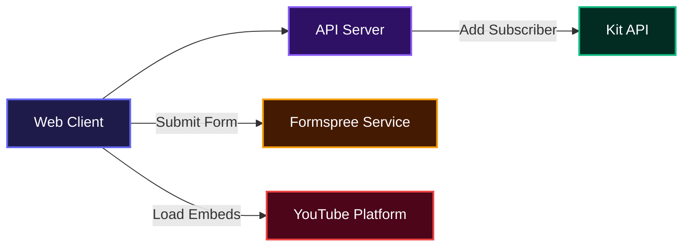
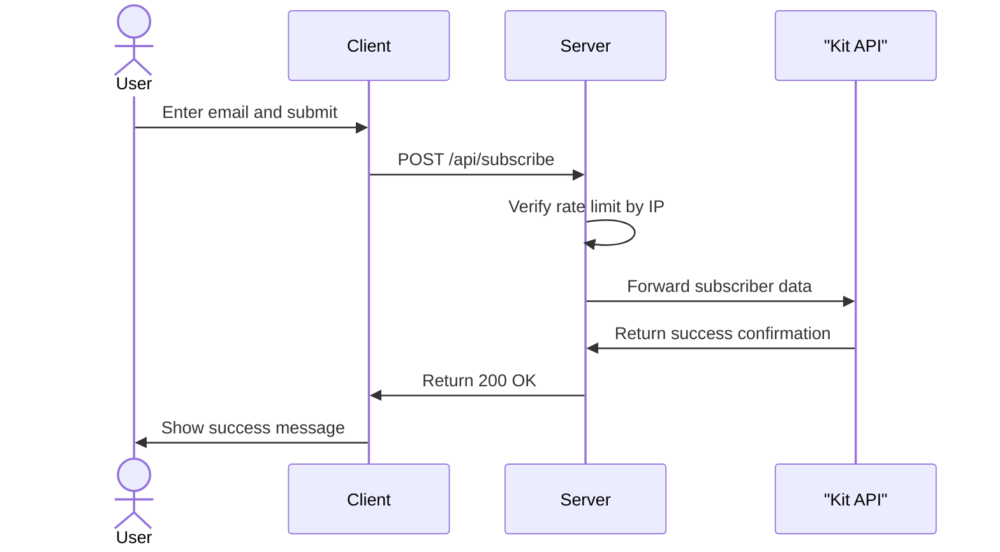

# Uncensored Grills

Uncensored Grills helps teams host and display unfiltered conversations with builders in the decentralized space. It captures guest applications, viewer questions, and newsletter signups while presenting video episodes in an immersive interface. 

## System Architecture



## Features

* **Episode Showcase**: Display video episodes with direct integrations to external video platforms, complete with timestamps and descriptions.
* **Guest Applications**: Collect potential guest profiles and stories directly through an integrated form pipeline.
* **Listener Questions**: Allow the audience to submit questions for upcoming episodes, surfacing the best content for the hosts.
* **Newsletter Subscription**: Capture emails securely with an internal rate-limited pipeline to prevent spam and abuse.



## Installation

Clone the Repository:
```bash
git clone https://github.com/jamzy-codes/unchained-grills.git
```

Install dependencies:
```bash
npm install
```

Configure your environment variables. Create a `.env.local` file in the root directory:
```bash
KIT_API_KEY=your_api_key_here
KIT_FORM_ID=your_form_id_here
```

Start the development server:
```bash
npm run dev
```

Open `http://localhost:3000` in your browser to see the application running.

## Usage

### Managing Guests and Episodes

The data for episodes and guests is managed directly within the component files. To add a new guest, update the `guests` array located inside `components/Guests.tsx`.

Add an entry with the following structure:
```typescript
{
  name: "New Guest Name",
  role: "Founder at Example",
  detail: "Brief description of their background",
  image: "/images/new-guest.jpg",
  xHandle: "@guest_handle",
  xUrl: "https://x.com/guest_handle",
  episode: "EP. 05",
  ytUrl: "https://youtu.be/example",
  epTitle: "Episode Title Here",
}
```

Follow the exact same process for episodes by editing the `episodes` array inside `components/Episodes.tsx`. Ensure you upload their corresponding image to the `public/images/` directory.

### Configuring Forms

The application uses Formspree to handle form submissions without requiring a database. You will need to create two forms on Formspree.

Update the endpoints in your components:
1. Open `components/GuestForm.tsx` and replace the `FORMSPREE_URL` constant with your guest form endpoint.
2. Open `components/AskQuestion.tsx` and replace the `FORMSPREE_URL` constant with your question form endpoint.

## API Documentation

### POST /api/subscribe

**Description**: Accepts an email address and registers the user to a newsletter via the Kit API. It includes an in-memory rate limiter that restricts requests to 5 attempts per minute per IP address.

**Request**:
```json
{
  "email": "user@example.com"
}
```

**Response (Success)**:
```json
{
  "success": true
}
```

**Response (Error)**:
```json
{
  "error": "Valid email required"
}
```

**Errors**:
* 400: Valid email required.
* 429: Too many subscription attempts. Please try again later.
* 500: Server error or missing configuration credentials.

**Environment Variables Required**:
* `KIT_API_KEY`: Authentication key for the Kit platform.
* `KIT_FORM_ID`: The unique identifier for the specific Kit subscription form.

## Technologies Used

| Technology | Purpose |
| :--- | :--- |
| Next.js | Application Framework |
| React | UI Library |
| Tailwind CSS | Styling |
| Three.js | 3D Graphics |
| Framer Motion | Animations |
| TypeScript | Type Safety |

## Author Info

* X (Twitter): https://x.com/Only_1_Jamzy

---

[](https://nextjs.org/)
[](https://reactjs.org/)
[](https://www.typescriptlang.org/)
[](https://tailwindcss.com/)
[](https://threejs.org/)

[](https://dokugen.samueltuoyo.com)